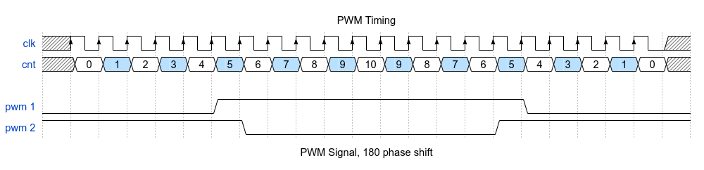
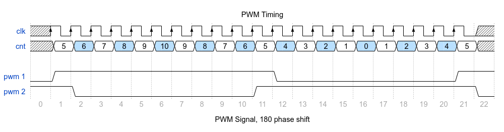

# STM32F3 Phase shifted PWM signal

For a project, we needed to generate two pwm signal with 55% duty cycle and a phase shift of 180 degrees.

We wanted a powerful microcontroller and hence we went with stm32. We also wanted to have hardware timer attached to the pins directly instead of using software to toggle pins.

Using hardware timers in *Output Configuration* allowed us to have reliable signal with almost no error in pwm generation.

We have written our code in *SPL (Standard Peripheral Library)*.

This is the required PWM Signal we need:


### Lets go over some segments of the code:


```c
// Configure Clock
void RCC_Configuration(void) {
  RCC_APB1PeriphClockCmd(RCC_APB1Periph_TIM4, ENABLE);
  RCC_AHBPeriphClockCmd(RCC_AHBPeriph_GPIOD, ENABLE);
}

// GPIO Configurations
void GPIO_Configuration(void) {
  GPIO_InitTypeDef GPIO_InitStructure;
  GPIO_StructInit(&GPIO_InitStructure);
  GPIO_InitStructure.GPIO_Pin = GPIO_Pin_12 | GPIO_Pin_14;
  GPIO_InitStructure.GPIO_Mode = GPIO_Mode_AF;
  GPIO_InitStructure.GPIO_Speed = GPIO_Speed_2MHz;
  GPIO_InitStructure.GPIO_OType = GPIO_OType_PP;
  GPIO_InitStructure.GPIO_PuPd = GPIO_PuPd_NOPULL;
  GPIO_Init(GPIOD, &GPIO_InitStructure);

  GPIO_PinAFConfig(GPIOD, GPIO_PinSource12, GPIO_AF_2);
  GPIO_PinAFConfig(GPIOD, GPIO_PinSource14, GPIO_AF_2);
}
```
For using pins and timers, we need to enable the bus clocks, that's what we do in the first function.

From the *STM Documentation* we know that _PD12_, _PD13_ correspond to _TIM4\_CH1_ and _TIM4\_CH3_ respectively. Also from the documentation we know that they need to be configured in _AF_4_ (Alternate function).

```c
Prescaler = 72;
Period = 20;

// Timer Base configurations
TIM_TimeBaseStructure.TIM_Period = Period / 2;
TIM_TimeBaseStructure.TIM_Prescaler = Prescaler - 1;
TIM_TimeBaseStructure.TIM_ClockDivision = 0;

// Timer counter mode
TIM_TimeBaseStructure.TIM_CounterMode = TIM_CounterMode_CenterAligned1;
TIM_TimeBaseInit(TIM4, &TIM_TimeBaseStructure);
```
For our use, we need a pwm signal of 50 khz. So we divide the system clock with 72 (72MHz/72 = 1 MHz, 1MHz/20 = 50kHz) and then set the period as 20. If we change the period when we have to change the prescaler as well to get the required 50kHz.

```c
TIM_SetCompare1(TIM4, upPulse);
TIM_SetCompare2(TIM4, downPulse);
```

CCR1 and CCR2 are used for TIM4_CH1 for specifying counter compare values which describe when to toggle voltage values.

Using the code we were able to generate the required pwm:


## Timing signals

Below are the timing signals which is required. As you can see we turn _pwm 1_ high at Counter value = 5 and then low at Counter value = 2. Similarly we specify values for _pwm 2_. Four Registers are needed to store these values (CCR1, CCR2, CCR3 & CCR4).




